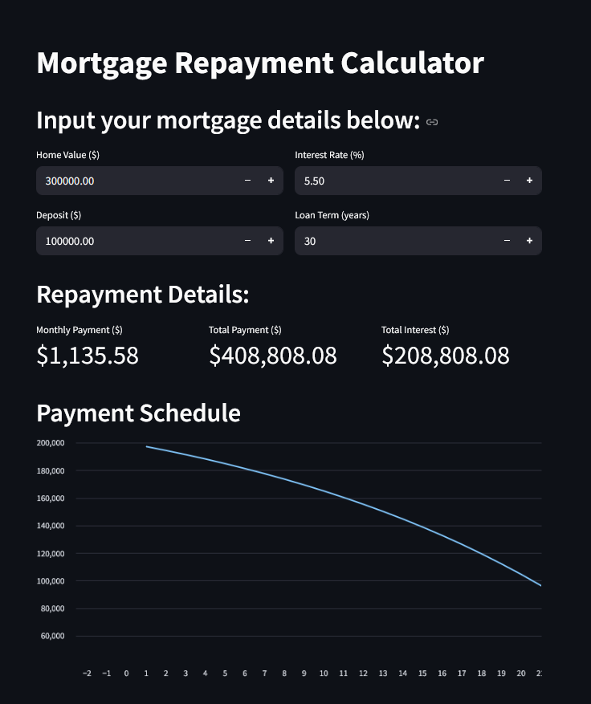

# Mortgage Calculator



## 🚀 Live Demo

**Try the app now:** [https://jccalix-mortgage-calculator-main-gozuax.streamlit.app/](https://jccalix-mortgage-calculator-main-gozuax.streamlit.app/)

A comprehensive mortgage repayment calculator built with Streamlit that helps users calculate monthly payments, total interest, and visualize payment schedules over the loan term.

## Features

- **Interactive Input Fields**: Enter home value, deposit, interest rate, and loan term
- **Real-time Calculations**: Automatic calculation of monthly payments, total payments, and total interest
- **Payment Schedule Visualization**: Interactive line chart showing remaining balance over time
- **Detailed Metrics Display**: Clear presentation of key financial figures
- **User-friendly Interface**: Clean, intuitive web-based interface

## Installation

1. Clone the repository:
   ```bash
   git clone https://github.com/Jccalix/Mortgage-Calculator.git
   cd Mortgage-Calculator
   ```

2. Install required dependencies:
   ```bash
   pip install -r requirements.txt
   ```

## Usage

Run the application:
```bash
streamlit run main.py
```

The application will open in your default web browser at `http://localhost:8501`.

## Input Parameters

- **Home Value**: Total price of the property
- **Deposit**: Down payment amount
- **Interest Rate**: Annual interest rate (%)
- **Loan Term**: Mortgage duration in years

## Calculations

The calculator uses the standard mortgage payment formula:
```
M = P × [r(1 + r)^n] / [(1 + r)^n - 1]
```
Where:
- M = Monthly payment
- P = Principal loan amount
- r = Monthly interest rate
- n = Total number of payments

## Technologies Used

- **Python 3.x**
- **Streamlit** - Web application framework
- **Pandas** - Data manipulation and analysis
- **Matplotlib** - Data visualization

## License

This project is open source and available under the [MIT License](LICENSE).

